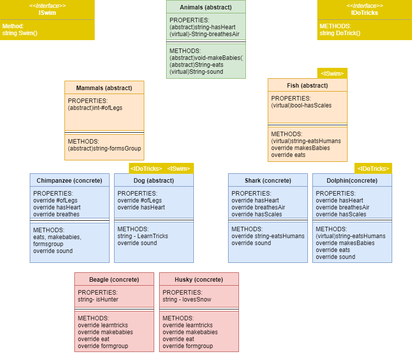

# Zoo
A a fun, whimsical zoo that is in no way realistic but allows for practive with inheritance, interfaces and the four OOP principles

## Class Hierarchy

## OOP Principles
### Abstraction
* Abstraction is the process of taking away or removing characteristics from something in order to reduce it to a set of essential characteristics.
	* ex: The base for the entire Zoo is a class of Animals with properties and methods that will cover most animals derived from it.

### Encapsulation
* Encapsulation is the principle of information containing or hiding. The internal workings of an object can be hidden from the rest of the program.
	* ex: The ability of the each class is limited to what it consists of and inherits from. It has no knowledge of the classes that aren't above it in the hierarchy.

### Inheritance
* Allows children classes the ability to use properties or behaviors from their parent class
	* ex: The entire zoo was an exercise in inheritance, every class inherting from Animals

### Polymorphism
* When properties and methods from parents can be changed by their children.
	* ex: The original Animals had all of them saying "Moo" but all of them eventually make a different sound

### Interface
* When implementing an interface you agree to use or change the behaviour and methods that make up the interface.
	* ex: My interfaces are ISwim and IDoTricks which gave certain animals the ability to do tricks or swim.
